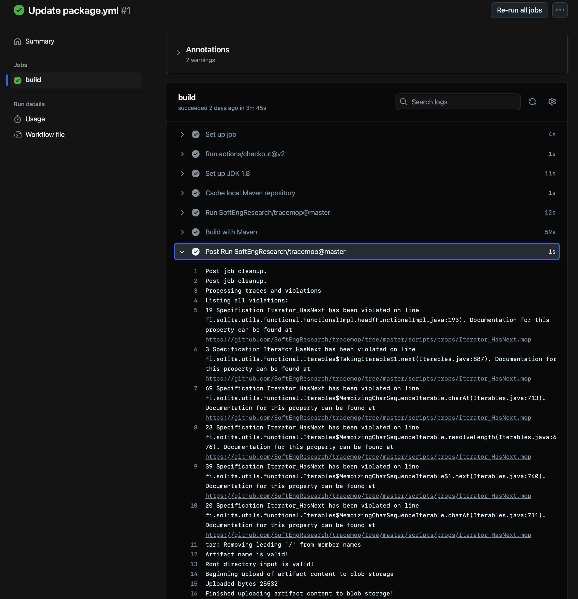
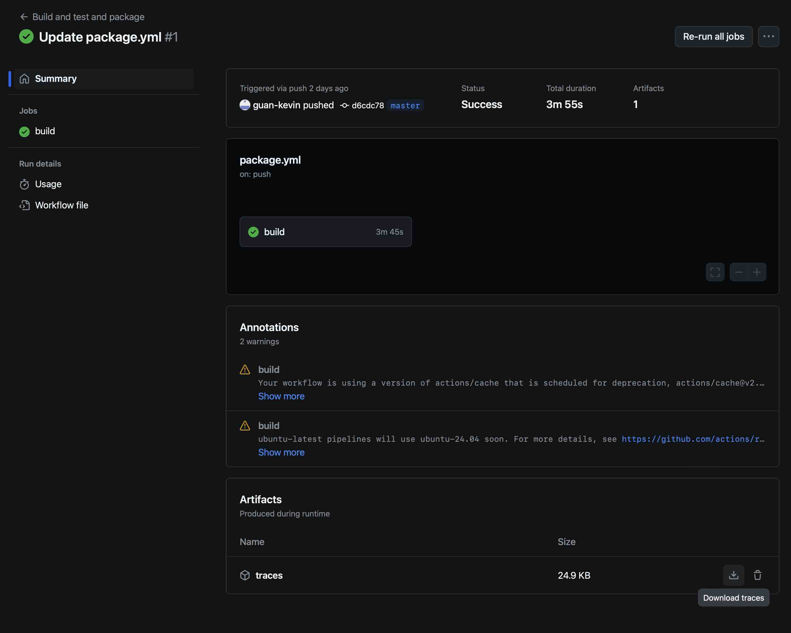

# Using TraceMOP in GitHub Actions

If a Maven project already set up GitHub Actions CI pipelines, all you need to do is to enable TraceMOP by adding one line to your GitHub Actions
workflow file (no need to modify pom.xml):

```yml
- uses: SoftEngResearch/tracemop@master
```

By default, in GitHub Actions pipelines, TraceMOP collects traces,
saves them to a traces directory, then uploads that directory to GitHub.
You can also set `collect-traces` to `false` to disable trace tracking:
```yml
- uses: SoftEngResearch/tracemop@master
    with:
        collect-traces: false
```

Or use `output-directory` to specify where to save the traces.

```yml
- uses: SoftEngResearch/tracemop@master
    with:
        output-directory: another-directory
```

[Here is an example of using TraceMOP in GitHub Actions](https://github.com/guan-kevin/functional-utils/blob/d6cdc789b00b941bd7a9cf962a9947d5d0336085/.github/workflows/package.yml#L27)

Here is a screenshot of the log (you can find the violations list in `Post Run SoftEngResearch/tracemop@master` section):



If you navigate to the `Summary` page, you will also see the option to download traces.


